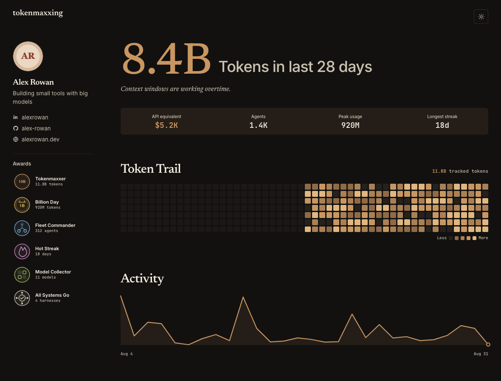

# Tokenmaxxing

Tokenmaxxing imports history from local AI coding harnesses into a private
SQLite ledger. It keeps model, provider, session, subagent, timing, token, and
cost metadata, then turns it into readable stats and an optional profile page.

[](https://anjay.sh/tokenmaxxing/)

## Install

Tokenmaxxing requires Python 3.12+.

```bash
uv tool install .
```

## CLI

```bash
tokenmaxxing sync
tokenmaxxing stats
tokenmaxxing export
tokenmaxxing profile init ~/my-token-profile
```

The first sync scans historical records and can take a while. Later syncs are
incremental and usually much faster.

```text
tokenmaxxing [--db PATH] [--debug] <command>
|-- sync [--source all|codex|claude|pi|opencode] [--json]
|-- stats [--period 7d|28d|all] [--group-by model|harness|day] [--json]
|-- export [PATH] [--timezone ZONE]
`-- profile [--config PATH] <command>
    |-- init [DIRECTORY] [--no-setup] [--editable-template] [--force]
    |-- edit [--publish]
    |-- preview [--host HOST] [--port PORT] [--no-open]
    |-- build [--output DIRECTORY] [--json]
    |-- publish [--sync] [--non-interactive] [--json]
    |-- status [--json]
    `-- schedule [enable|disable|status]
```

`stats` defaults to a 28-day model view with compact token totals and an
approximate public API-equivalent value. `export` writes aggregate JSON to
disk. Run any command with `--help` for its full options.

## Local SQLite ledger

Everything stays in one SQLite database on your machine. It stores:

- source, model, provider, timestamps, and status
- stable session, run, turn, and model-call IDs, including subagent links
- input, output, cache, reasoning, and total token counts
- reported costs or labelled estimates when available
- sync cursors, conflict state, and salted workspace fingerprints

Fields vary by harness, and missing values stay missing. Reasoning tokens are
numeric counts only. Conversation text, commands, tool arguments and results,
attachments, and raw errors are not copied into the database.

Syncs are transactional, incremental, and idempotent. Totals prefer a
source-reported total, then a derived total, then non-overlapping components.
See [Setup](docs/setup.md) for paths, overrides, and backups, or
[Architecture](docs/architecture.md) for the accounting rules.

## Public profile

```bash
tokenmaxxing profile init ~/my-token-profile
```

`profile init` handles the public details, first sync, preview, deployment
command, and optional daily schedule.

After setup:

```bash
tokenmaxxing profile preview
tokenmaxxing profile publish --sync
tokenmaxxing profile schedule enable
```

The static site is written to `dist/` and published with the deployment command
saved in `config.yaml`. It contains public profile fields and aggregate stats,
never the private ledger.

## Privacy and estimates

The static site contains only configured public fields and aggregate stats.
API-equivalent value is an estimate, not a bill: source costs take precedence,
otherwise dated public rates apply only when billable token components fully
reconcile. Unsupported models remain unpriced rather than being treated as
free. Subscriptions, tools, media, and cache storage time are excluded.

## Development

```bash
uv sync --locked
uv run pytest
uv run ruff check .
git diff --check
uv build
```

Read [AGENTS.md](AGENTS.md) before changing accounting, privacy, profile, or
deployment behavior. Tokenmaxxing is licensed under the [MIT License](LICENSE).
